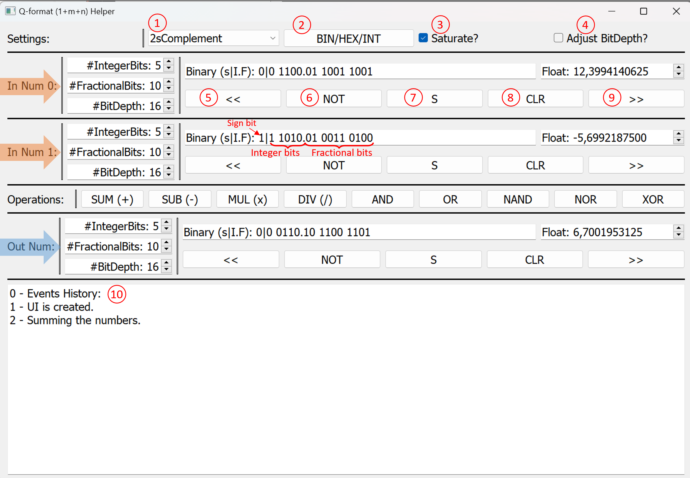

# QNumberHelper
A handy helper for operations with Q-format numbers.

# Installation
Create the environment and make sure that you installed the packages as given in the requirements.txt

conda create --name <env> --file requirements.txt
conda activate <env> 

# Running the UI
execute

RunHelper

or run via the command below

python QNumberHelperUI.py

# Some Notes
## QNum Class
You can get the QNum class from QNumber/QNumber.py. It includes the definition of the QNum class together with some private and public methods. The class assumes Qm.n format as explained in https://en.wikipedia.org/wiki/Q_(number_format). So the total bitdepth includes the sign bit as well, bit_depth = 1 (sign bit) + num_int_bits + num_frac_bits.

Negative numbers can be represented in various ways, sign_magnitude, 1's compement, 2's complement. The default representation is 2's complement

Note that some of the operations defined for the negative numbers, such as bit shift, division etc. are highly implementation dependent. Therefore, it would be beneficial to look into their implementation before using.

## User Interface
Refer to the image below.

The UI consists of the following sections:
- Settings.
- Input Number 1 and 2
- Operation
- Output Number
- Events History Window

1. User can select the format of the binary number from here. This impacts the representation of the negative numbers
2. Toggle between Binary / Hexadecimal / Integer views for the number
3. If the number cannot be represented by the amount of bits in the number container, should it be saturated to max value or should it let to overflow?
4. In case the output number container is not enough for representing the resulting number, should that be adjusted accordingly?
5. Left bit shift operator
6. Invert the bits of the number
7. Toggle the sign bit
8. Clear the number
9. Right bit shift operator
10. Window to print the main events 

Enjoy the UI!

